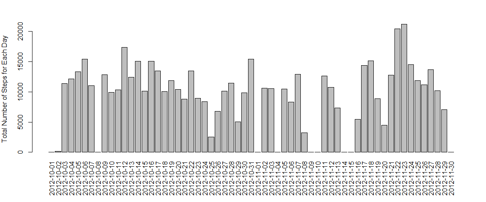
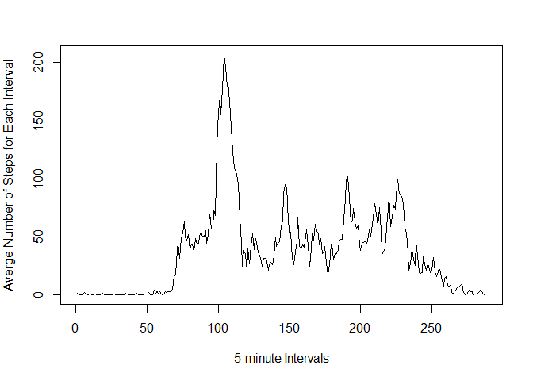
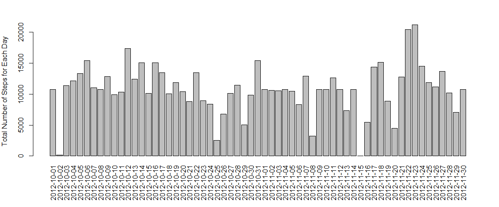
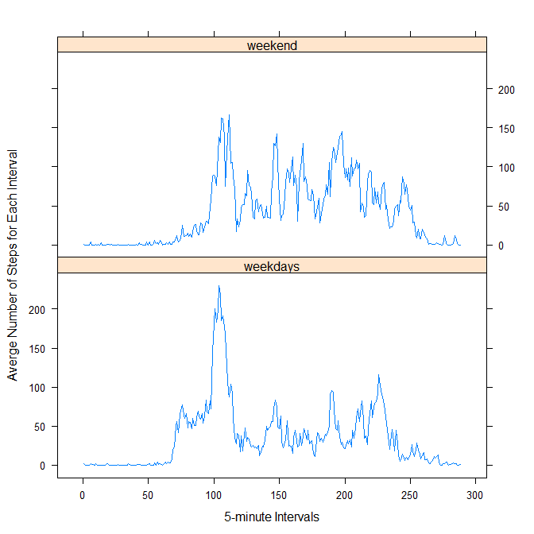

# Reproducible Research: Peer Assessment 1


This report documents the answers for Peer Assessment 1 of the Coursera course
Reproducible Reasearch.  

The activity monitoring data is assumed to already be downloaded and stored in
the same directory of the R markdown document. In addition, below are the 
libraries required for this assessment.


```r
library(dplyr)
library(lattice)
```

## Loading and preprocessing the data

Load the data from file `./activity.csv`. The variables included in this dataset
are:

* steps: Number of steps taking in a 5-minute interval (missing values are coded
as `NA`)

* date: The date on which the measurement was taken in YYYY-MM-DD format

* interval: Identifier for the 5-minute interval in which measurement was taken 
and display the structure of the raw data.

The only processing required is to covert the date data into class "Date".


```r
unzip('activity.zip')

dataRaw <- read.csv("./activity.csv")

dataRaw$date <- as.Date(dataRaw$date,"%Y-%m-%d")

str(dataRaw)
```

```
## 'data.frame':	17568 obs. of  3 variables:
##  $ steps   : int  NA NA NA NA NA NA NA NA NA NA ...
##  $ date    : Date, format: "2012-10-01" "2012-10-01" ...
##  $ interval: int  0 5 10 15 20 25 30 35 40 45 ...
```

A summary of the processed dataset is shown below.


```r
summary(dataRaw)
```

```
##      steps             date               interval     
##  Min.   :  0.00   Min.   :2012-10-01   Min.   :   0.0  
##  1st Qu.:  0.00   1st Qu.:2012-10-16   1st Qu.: 588.8  
##  Median :  0.00   Median :2012-10-31   Median :1177.5  
##  Mean   : 37.38   Mean   :2012-10-31   Mean   :1177.5  
##  3rd Qu.: 12.00   3rd Qu.:2012-11-15   3rd Qu.:1766.2  
##  Max.   :806.00   Max.   :2012-11-30   Max.   :2355.0  
##  NA's   :2304
```


## What is mean total number of steps taken per day?

Calculate the total number of steps taken per day (ignoring the missing values 
in the dataset). 


```r
dataByDate <- dataRaw %>% 
    group_by(date) %>% 
    summarise(totalsteps = sum(steps, na.rm = TRUE))
```

Make a histogram of the total number of steps taken per day. 

Here, function `barplot` is used instead of `hist`. This is because `hist` plots
the counts of the input data. For example, if 15,000 steps were taken in day 1, 
the height of the bar containing 15,000 will be increased by 1, instead of the
correct height of 15,000. Hence, as the total number of steps is contained in 
column "totalsteps", this can be plotted as height of a `barplot`.


```r
par(mar = c(6,4,3,2), las = 3)

barplot(
    height = dataByDate$totalsteps, 
    width = 5,
    names.arg = dataByDate$date, 
    ylab = "Total Number of Steps for Each Day")
```

 

Calculate the mean and median of the total number of steps taken per day.


```r
meanSteps <- mean(dataByDate$totalsteps)
medianSteps <- median(dataByDate$totalsteps)
```

The sample mean and median total number of steps taken per day are 
**9,354.23** and 
**10,395** 
respectively.

## What is the average daily activity pattern?

Calculate the average number of steps taken of the 5-minute interval, averaged 
across all days.


```r
dataByInterval <- dataRaw %>%
    mutate(interval = factor(interval)) %>%
    group_by(interval) %>% 
    summarise(averagesteps = mean(steps, na.rm = TRUE))
```

Make a time series plot of the average number of steps across the 5-minute
interval.


```r
par(mar = c(5,4,3,2), las = 0)

plot(
    x = as.numeric(dataByInterval$interval), 
    y = dataByInterval$averagesteps, 
    type = "l",
    xlab = "5-minute Intervals",
    ylab = "Averge Number of Steps for Each Interval")
```

 

Find the 5-minute interval, on average across all the days in the dataset, 
containing the maximum number of steps.


```r
maxSteps <- max(dataByInterval$averagesteps)
maxInterval <- dataByInterval$interval[dataByInterval$averagesteps == maxSteps]
```

Interval containing the maximum number of average steps is 
**835**, and the corresponding number of maximum steps is 
**206.17**.

## Imputing missing values

Calculate and report the total number of missing values in the dataset
(i.e. the total number of rows with `NA`s).


```r
sum(is.na(dataRaw$steps))
```

```
## [1] 2304
```

Fill all the missing values in the dataset by the mean for that 5-minute 
interval. This is done by first merging the data of average number of steps 
across the 5-minute into the original dataset. Function `mutate` is used to set
the steps to the average if data is missing (i.e. value of `NA`). 

Store the new dataset into a new variable.


```r
dataFilled <- merge(dataRaw, dataByInterval, by = "interval")

dataFilled <- dataFilled %>%
    mutate(steps = ifelse(is.na(steps), averagesteps, steps)) %>%
    arrange(date, interval) %>%
    select(-averagesteps)
```

Calculate the total number of steps taken each day (with empty data filled).


```r
dataByDateFilled <- dataFilled %>% 
    group_by(date) %>% 
    summarise(totalsteps = sum(steps))
```

Make a histogram of the total number of steps taken per day (with empty data
filled), and then calculate the mean and median of the total number of steps 
taken per day.


```r
par(mar = c(6,4,3,2), las = 3)

barplot(
    height = dataByDateFilled$totalsteps, 
    width = 5,
    names.arg = dataByDateFilled$date, 
    ylab = "Total Number of Steps for Each Day")
```

 

```r
meanStepsFilled <- mean(dataByDateFilled$totalsteps)
medianStepsFilled <- median(dataByDateFilled$totalsteps)
```

The sample mean and median total number of steps taken per day are 
**10,766.19** and 
**10,766.19** 
respectively.

The mean and median diff from the estimated from the first part of the 
assignment, and both have increased. This is because ignoring the missing
data is effecitve assigning zero steps on those interval. Imputing missing
values by the mean for that 5-minute interval will increase the total number
of steps (assuming steps cannot go negative), and hence both mean and median
will be increased.

## Are there differences in activity patterns between weekdays and weekends?

Create a new factor variable in the dataset with two levels - "weekday" and 
"weekend" indicating whether a given date is a weekday or weekend day.


```r
dataFilled <- dataFilled %>%
    mutate(weekday = ifelse(weekdays(date) %in% c("Saturday", "Sunday"),
                            "weekend",
                            "weekdays")) %>%
    mutate(weekday = factor(weekday))
```

Make a panel plot containing a time series plot of the 5-minute interval vs the
average number of steps taken, averaged across all weekday days or weekend days. 


```r
dataByIntervalFilled <- dataFilled %>%
    mutate(interval = factor(interval)) %>%
    group_by(interval, weekday) %>% 
    summarise(averagesteps = mean(steps, na.rm = TRUE))

par(mar = c(5,4,4,2), las = 0)

xyplot(
    averagesteps ~ as.numeric(interval) | weekday, 
    data = dataByIntervalFilled, 
    type ="l", 
    layout = c(1, 2),
    xlab = "5-minute Intervals",
    ylab = "Averge Number of Steps for Each Interval")
```

 

From the above plots, it can be seen that activities seem to start earlier 
during weekdays then weekend. Presumably, this is due to the fact that people 
tend to wake up earlier in the weekdays for going to work.
